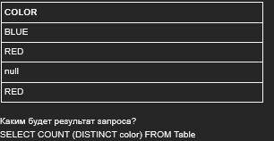
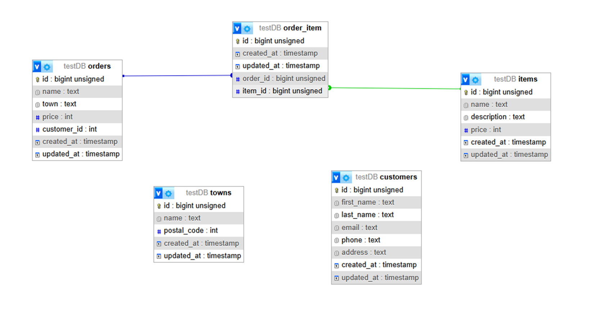
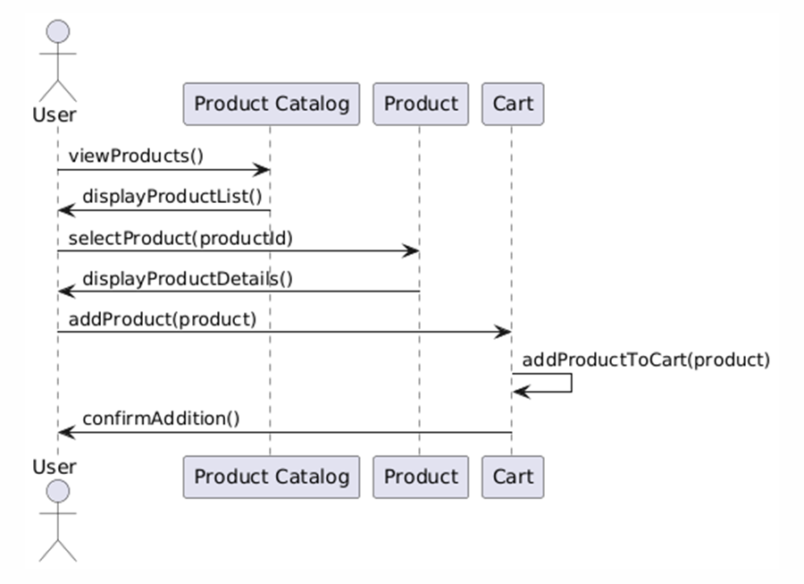
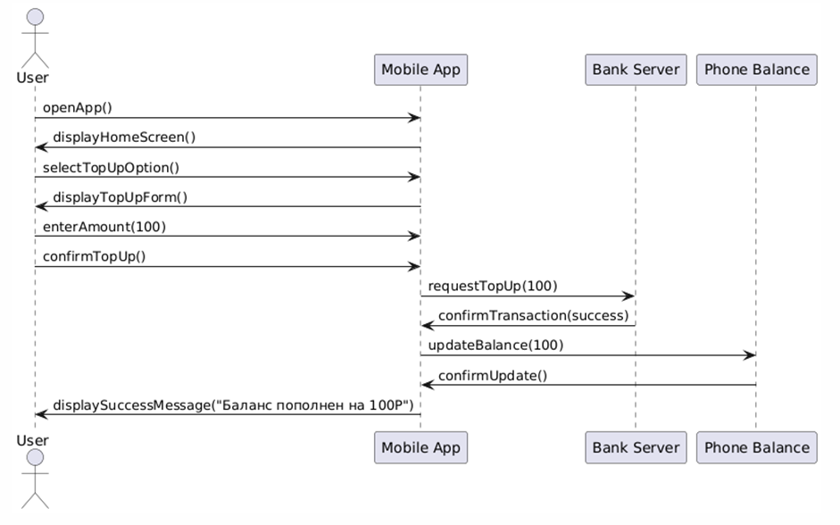

## Задание 1

| Вопрос | Ответ 
|-------------|-------------|
| Содержит ли какую-то информацию таблица, в которой нет полей?   | 3. Таблица без полей существовать не может   
| В записи файла реляционной БД может содержаться:  | 4. Неоднородная информация (данные разных типов)  
| Чем первичный ключ отличается от внешнего ключа?   | 2. Значения первичного ключа всегда должны быть уникальными и не могут быть null, значения внешнего ключа могут повторяться 
| В какой нормальной форме говорится о том, что все атрибуты зависят от первичного ключа, а не от его части?  | 2. 2НФ  
| В каком порядке в СУБД выполняются операторы SELECT, FROM, GROUP BY?  | 4. Сначала FROM, потом GROUP BY и только потом SELECT  
| Чем отличается оператор WHERE от HAVING  | 2. Оператор HAVING применяется для фильтрации групп, а WHERE - для фильтрации отдельных строк  
| Какой результат покажет выполнение операторов SELECT COUNT (*)?  | 3. Число строк таблицы, указанной во FROM, включая значение NULL
| В таблице «Animals» базы данных зоопарка содержится информация обо всех обитающих там животных, в том числе о лисах: red fox, grey fox, little fox. Напишите запрос, возвращающий информацию о возрасте лис  | 1. SELECT age FROM Animals WHERE Animal LIKE “%fox”  
| Чем отличается DELETE от TRUNCATE?  | 2. DELETE используется для удаления одной или нескольких строк из таблицы, а TRUNCATE используется для удаления всех строк из таблицы 
| Дана таблица: | 4. 2  

## Задание 2

## Задание 3 

### Описание API (OpenAPI)

1. [Отображение витрины товаров](example1.yaml)
2. [Переход с витрины а экран с детальным описание товара](example2.yaml)
3. [Добавление товара в корзину](example3.yaml)

## Задание 3.2 Построение Sequence UML 

## Задание 4

